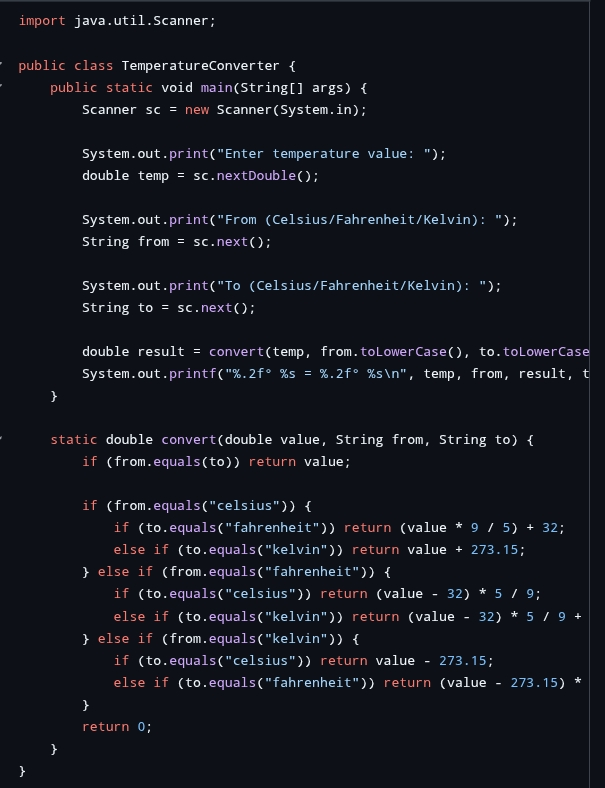
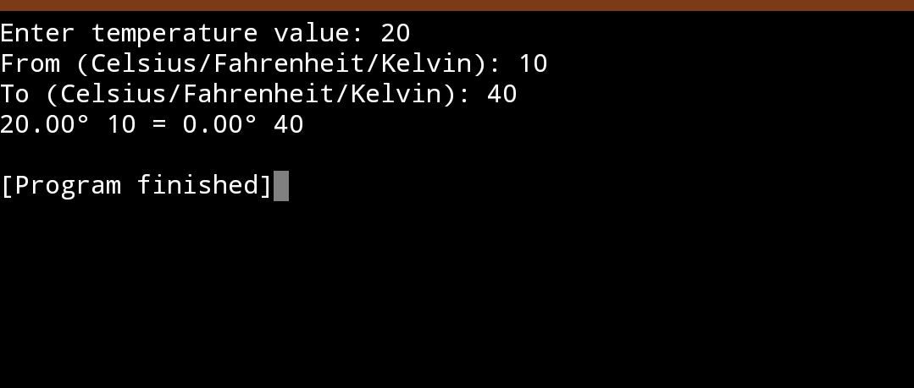

# Prodigy-infotech-task-1
Software development internship 


# Prodigy Infotech Internship - Task 1

## 💼 Internship Domain:
**Software Development Internship**  
**Organization:** Prodigy Infotech

## 📌 Task 1: Java Program

This task involves implementing a **Java-based application** that demonstrates core programming concepts such as:
- Object-Oriented Programming (OOP)
- Control Structures
- Input/Output
- Clean code structure

## 📂 Project Structure

Prodigy-infotech-task-1/ ├── Task1.java ├── README.md ├── Screenshots/ │   ├── Screenshot_1.jpg │   └── Screenshot_2.jpg

## 🖼️ Screenshots

### 📷 Program Output


### 📷 Program Execution


## 🚀 How to Run

1. Clone this repository.
2. Open `Task1.java` in any Java IDE (e.g., IntelliJ IDEA, Eclipse) or use the terminal.
3. Compile the program:
   ```bash
   javac Task1.java

4. Run the program:

java Task1


✅ Output

Displays appropriate output based on the logic inside Task1.java.

🧠 Skills Gained

Java Syntax & Semantics

Debugging

OOP and logic building


🔗 Connect with Me

🔹 LinkedIn
🔹 GitHub


---

© 2025 Aravind Kumar | All rights reserved.
